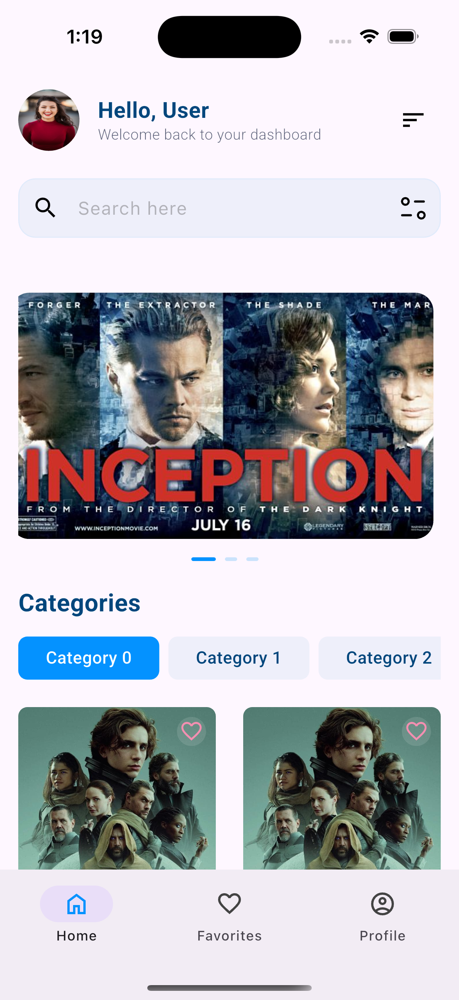
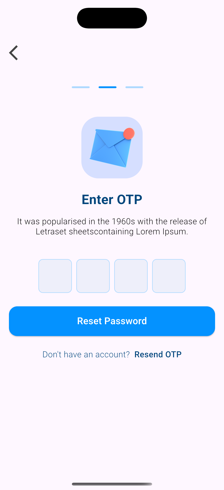

# 🎬 Movie Hub

  

Movie Hub is a hobby Flutter application built to explore core Flutter concepts, navigation, API handling, and Firebase integration. The app offers a modern movie discovery experience with user authentication, onboarding flow, and a sleek UI.

  

## 📱 Preview

  
  
  

  
  
  

  
  
  

## 🛠️ Built With

- **Flutter** – UI toolkit for crafting beautiful apps

- **Dart** – Programming language used for Flutter

- **go_router** – Declarative routing and navigation

- **Dio** – Powerful HTTP client for Dart

- **Firebase** – For authentication and backend integration

- Other dependencies:

- `flutter_hooks`, `flutter_svg`, etc.

  
---

## 🔐 Features

- Splash screen and animated onboarding

- Firebase Auth with Email/Password, Google, and Facebook

- Forgot Password with OTP flow

- Home screen with:

- Movie banner carousel

- Category filtering

- Favorite toggle

- Clean UI design with responsive layout

  

---

## 🚀 Getting Started

### Prerequisites

- Flutter SDK (>=3.6.0)

- Dart (>=3.7.2)

- Firebase project set up

- iOS/Android simulator or physical device

### Folder Structure

lib/

├── main.dart

├── routes/ # go_router setup

├── screens/ # UI pages like Login, Home, etc.

├── widgets/ # Reusable components

├── services/ # API and Firebase services

└── models/ # Data models

### ## Why I Built This

This is a **hobby project** to:

- Learn and apply **Flutter best practices**
    
- Practice using `go_router` for navigation
    
- Integrate REST APIs using **Dio**
    
- Understand **Firebase Authentication**
    
- Improve design and UI skills