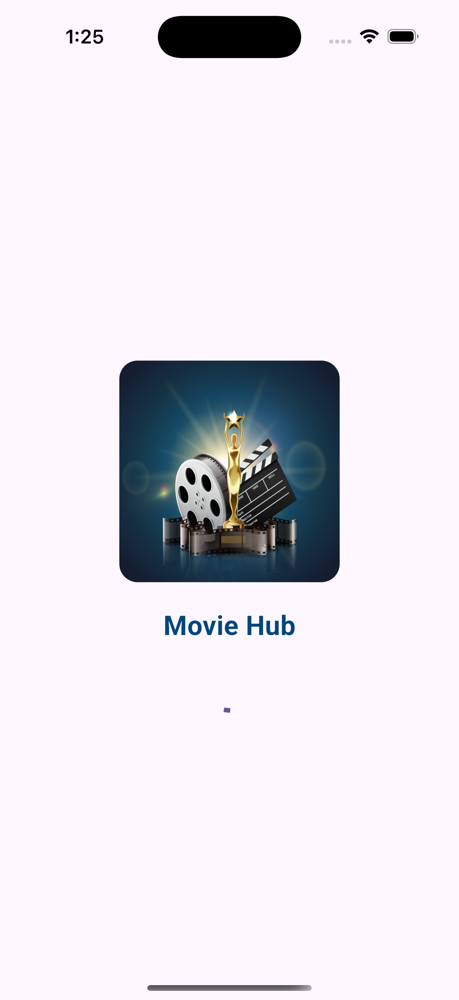
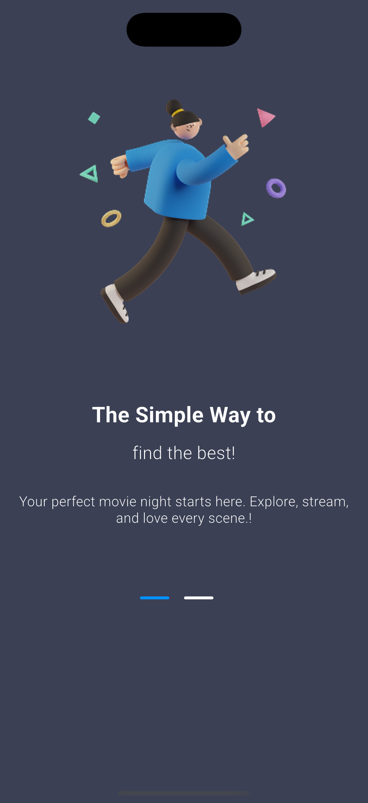
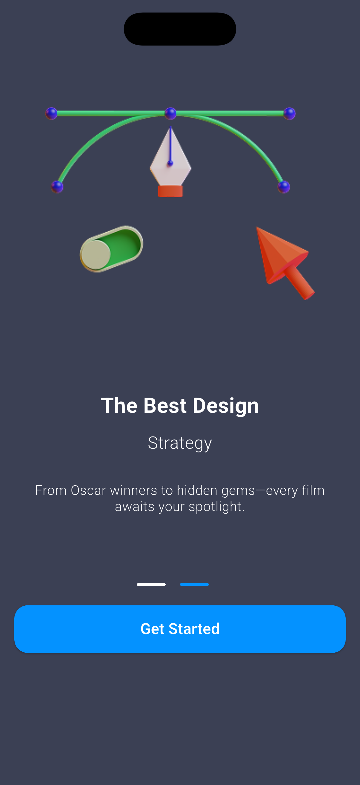
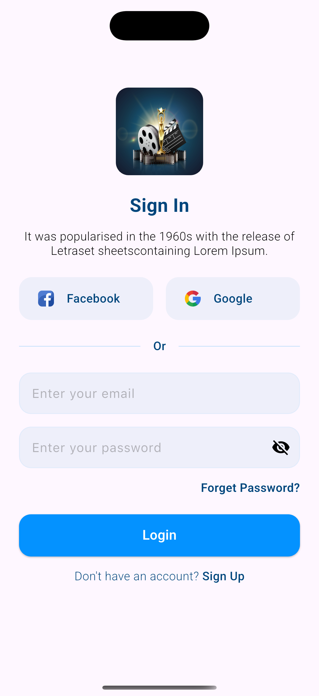
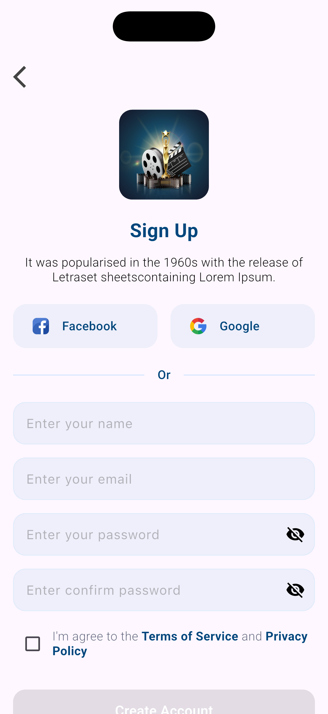
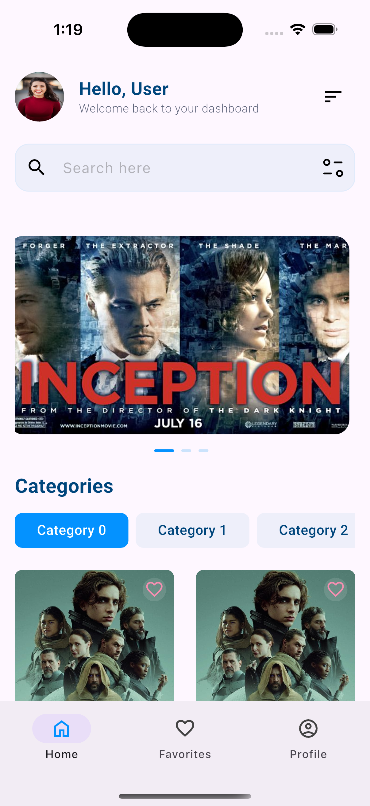
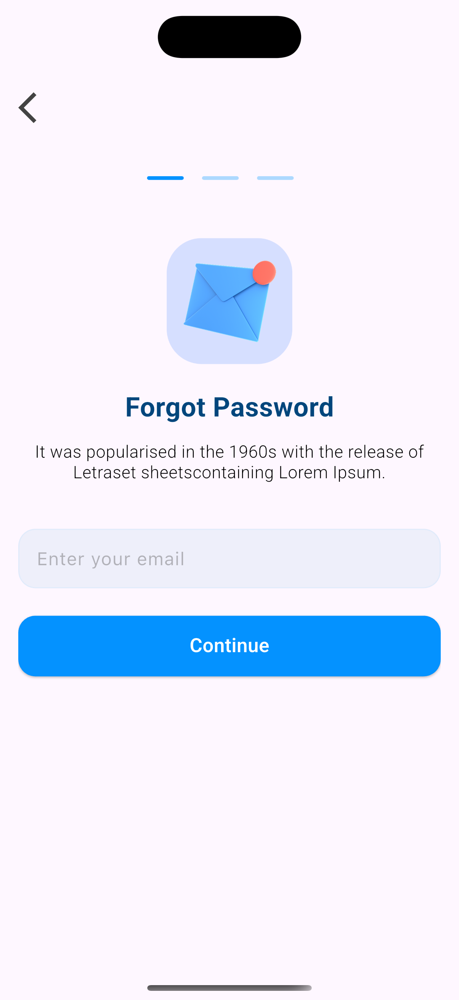
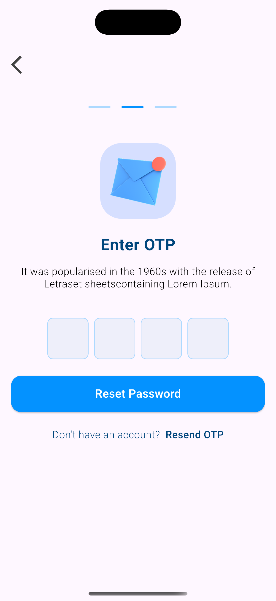
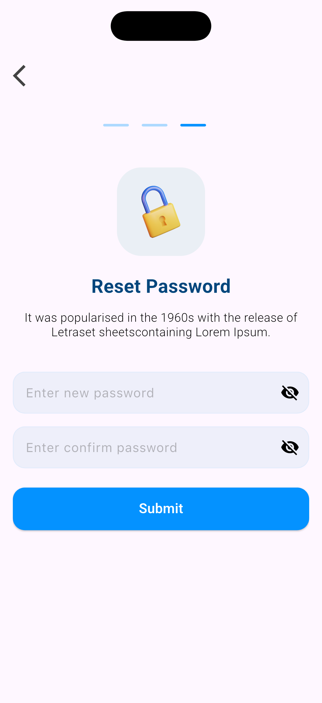

# 🎬 Movie Hub

  

Movie Hub is a hobby Flutter application built to explore core Flutter concepts, navigation, API handling, and Firebase integration. The app offers a modern movie discovery experience with user authentication, onboarding flow, and a sleek UI.

  

## 📱 Preview

  
  
  

  
  
  

  
  
  

## 🛠️ Built With

- **Flutter** – UI toolkit for crafting beautiful apps

- **Dart** – Programming language used for Flutter

- **go_router** – Declarative routing and navigation

- **Dio** – Powerful HTTP client for Dart

- **Firebase** – For authentication and backend integration

- Other dependencies:

- `flutter_hooks`, `flutter_svg`, etc.

  
---

## 🔐 Features

- Splash screen and animated onboarding

- Firebase Auth with Email/Password, Google, and Facebook

- Forgot Password with OTP flow

- Home screen with:

- Movie banner carousel

- Category filtering

- Favorite toggle

- Clean UI design with responsive layout

  

---

## 🚀 Getting Started

### Prerequisites

- Flutter SDK (>=3.6.0)

- Dart (>=3.7.2)

- Firebase project set up

- iOS/Android simulator or physical device

### Folder Structure

lib/
├── core/                      ← things used app-wide
│   ├── error/                 ← error types, exceptions, failures
│   ├── network/               ← HTTP client, interceptors
│   └── usecase/               ← base UseCase class
│
├── data/                      ← data layer: DTOs, API, repo impl
│   ├── models/                ← response models (e.g. JSON serializable)
│   ├── mappers/               ← convert models ↔ entities
│   ├── datasources/           ← ApiServices, local DB, cache
│   │   └── remote/            ← REST APIs
│   ├── repositories/          ← RepoImpl: implements interface
│   └── data_module.dart       ← DI bindings for data layer
│
├── domain/                    ← domain layer: pure business logic
│   ├── entities/              ← Entity (used in app core logic)
│   ├── repositories/          ← abstract Repository interfaces
│   ├── usecases/              ← UseCase classes (one per action)
│   └── domain_module.dart     ← DI bindings for domain layer
│
└── presentation/              ← UI layer: widgets, state management
    ├── blocs/ or cubits/      ← BLoC/Cubit classes (controllers)
    ├── pages/                 ← Screens, Widgets
    └── presentation_module.dart ← DI bindings for presentation

### ## Why I Built This

This is a **hobby project** to:

- Learn and apply **Flutter best practices**
    
- Practice using `go_router` for navigation
    
- Integrate REST APIs using **Dio**
    
- Understand **Firebase Authentication**
    
- Improve design and UI skills

### add this package to my app
- https://pub.dev/packages/device_preview